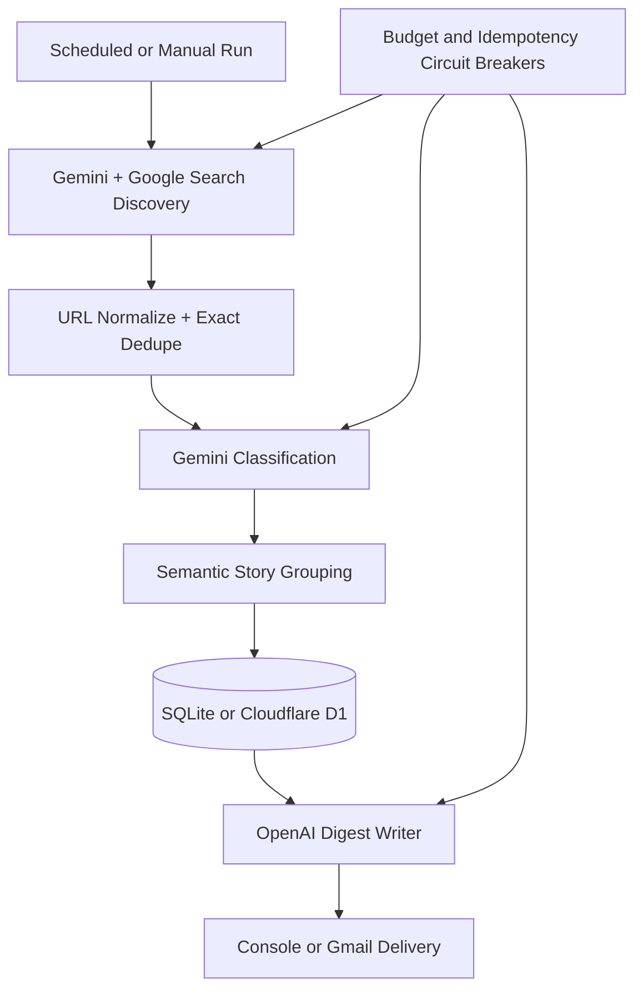

# daily-digest-agent

**Version 1.0.0 — private-fork ready.** See `docs/private-fork-setup.md` for deployment and
`docs/operations.md` for recovery and routine operations.

A lightweight, topic-agnostic Python framework that discovers recent web developments, filters and
deduplicates them, writes a source-grounded newsletter, persists state, and delivers on a schedule.
It runs once and exits: no server, queue, browser automation, or always-on infrastructure.

## Architecture



Provider APIs stay behind typed interfaces. The pipeline contains no topic, geography, category,
recipient, or provider credential assumptions.

## Features

- Independent grounded discovery missions with health accounting
- Configurable strict rejection and reporting of candidates without matching grounding metadata
- Deterministic URL canonicalization and semantic story grouping
- Relevance, category, and 0–5 importance classification
- SQLite development state and parameterized Cloudflare D1 REST persistence
- Hard per-run, daily, and estimated monthly application limits
- Deterministic quiet-day output only when discovery coverage is healthy, without a writer-model call
- Structured OpenAI writer output with plain text and email-safe HTML
- Console and Gmail OAuth delivery
- Local-date idempotency, UTC internal timestamps, bounded retries, and prompt-injection guardrails

## Quickstart

Requires Python 3.12 or newer.

```bash
python -m venv .venv
source .venv/bin/activate
pip install -e ".[dev]"
daily-digest-agent validate-config --config config/example.yaml
daily-digest-agent init-db --config config/example.yaml
pytest
```

Copy `config/example.yaml` to `config/digest.yaml`, then change only configuration to define the
topic, categories, missions, thresholds, models, storage, and delivery. Model names are deliberately
configurable because provider availability changes. The configured default writer identifier is
`gpt-5.6-luna`; confirm that the identifier is enabled for your OpenAI project before a live run.
The example pricing values are placeholders, not guaranteed-current vendor prices. Verify all model
prices against provider documentation before deployment.

## Commands

```bash
daily-digest-agent validate-config --config config/digest.yaml
daily-digest-agent init-db --config config/digest.yaml
daily-digest-agent run --config config/digest.yaml
daily-digest-agent run --config config/digest.yaml --dry-run
daily-digest-agent run --config config/digest.yaml --force
daily-digest-agent show-budget --config config/digest.yaml
daily-digest-agent show-budget-reservations --state reserved --config config/digest.yaml
daily-digest-agent release-budget-reservation --id RESERVATION_ID --reason "reason" --unsafe-release --config config/digest.yaml
daily-digest-agent show-stale --older-than-hours 6 --config config/digest.yaml
daily-digest-agent show-last-run --config config/digest.yaml
daily-digest-agent show-deliveries --config config/digest.yaml
daily-digest-agent show-delivery --id DELIVERY_ID --config config/digest.yaml
daily-digest-agent retry-delivery --id DELIVERY_ID --config config/digest.yaml
```

`--force` bypasses only the successful-run count. It does not bypass provider or monthly caps.
`--force-send` separately creates a new delivery attempt for the same configured local date.
Delivery history includes provider receipts such as Gmail message IDs. `retry-delivery` accepts only
`failed` or `unknown` attempts with an existing persisted digest, creates a new numbered attempt, and
resends that digest without repeating paid discovery, classification, or writing.
Budget reservation release is an audited emergency action. Use it only after provider evidence confirms
that an ambiguous request was not billed. `show-stale` is diagnostic and never mutates records.
`--unsafe-budget-override` is an explicit emergency escape hatch. `--offline` fails closed unless a
fixture integration is supplied; automated tests use fake providers and never contact a network.

## Providers

| Subsystem | V1 provider |
|---|---|
| Discovery | Gemini with Google Search grounding |
| Classification | Gemini |
| Writer | OpenAI Responses API |
| Storage | SQLite, Cloudflare D1 REST API |
| Delivery | Console, Gmail API OAuth |

The console provider prints plain text and optionally writes HTML under `./output/`. Gmail sends a
multipart `text/plain` and `text/html` message and never uses a Gmail password.

## Environment variables

Copy `.env.example` into your secret-management system. Supported variables are
`DIGEST_CONFIG_PATH`, `GEMINI_API_KEY`, `OPENAI_API_KEY`, `CLOUDFLARE_ACCOUNT_ID`,
`CLOUDFLARE_API_TOKEN`, `D1_DATABASE_ID`, `GMAIL_CLIENT_ID`, `GMAIL_CLIENT_SECRET`,
`GMAIL_REFRESH_TOKEN`, `GMAIL_SENDER`, `DIGEST_RECIPIENT`, `DRY_RUN`, and `LOG_LEVEL`.
The application does not automatically load `.env`; use your shell, CI secret store, or a local
environment loader. Never commit credentials.

## Local development and tests

SQLite and console delivery require no Cloudflare or Gmail setup. All tests inject fake discovery,
classification, writer, and delivery providers and run without paid calls:

```bash
ruff check src tests
mypy src
pytest
python -m build
python -m pip_audit --skip-editable
```

CI builds both a wheel and source distribution, verifies required runtime modules in each artifact,
installs the wheel into a clean virtual environment, and runs CLI/import smoke tests outside the
source tree. Deployment configuration remains external to the Python package.
Reproducible deployment and development versions are listed in `constraints/runtime.txt` and
`constraints/dev.txt`. CI audits the constrained environment for known Python package vulnerabilities.

## Cost safeguards

The state store, not GitHub Actions, records calls and successful runs. Checks happen before the run
and every paid request. Retries are bounded and each retry counts as another provider call. Operational
timestamps are stored in UTC, while daily and monthly budget accounting uses the configured digest-local
calendar date and month. This prevents UTC boundaries from moving usage into the wrong accounting day.
SQLite and D1 use forward-only numbered schema migrations. Initialization is repeatable, legacy
unversioned databases are upgraded, and startup fails closed if the database schema is newer than the
running application.

Model pricing is user-maintained configuration because vendor prices change. Missing pricing blocks
paid requests by default. `allow_unknown_pricing: true` permits calls under request-count limits but
logs that dollar accounting is incomplete. The monthly safety buffer stops new calls conservatively
before the cap. For priced models, each request reserves its configured maximum input/output cost
before execution and reconciles successful calls to actual token usage. Failed or ambiguous calls keep
their reservation, preventing concurrent or retrying workers from overspending the application
threshold. Provider-side billing remains authoritative.

SQLite performs budget reservations under `BEGIN IMMEDIATE`. D1 uses a single conditional
`INSERT ... SELECT ... WHERE` statement so its aggregate budget check and reservation are evaluated by
the database as one write operation. The REST API does not expose the Workers Binding API's
transactional `batch()` primitive, so cross-statement atomic operations are intentionally avoided.
Successful priced calls are accounted from the reconciled reservation ledger, allowing D1 to record
actual cost with one authoritative update. Delivery completion likewise uses the delivery attempt as
the authoritative sent-state row; SQLite updates its legacy digest timestamp in the same transaction.
Digest rows are authoritative for included story IDs. SQLite updates denormalized story flags in the
same transaction; D1 treats those flags as best-effort indexes so a secondary update failure cannot
erase or invalidate an already-recorded digest.

## Failure and security model

Discovery missions fail independently, but the normal newsletter is withheld when the configured
success ratio is not met. A healthy zero-result run produces and persists a short deterministic
quiet-day digest without invoking OpenAI. Accepted
stories are persisted even when omitted due to the digest story limit. Non-dry-run delivery is reserved
before paid work begins. A unique date/attempt record prevents concurrent duplicate sends; delivery
exceptions after sending starts are recorded as `unknown` and block automatic retry. `--force-send`
creates an explicit new attempt when an operator has reviewed that state.

Public web content is hostile input. Prompts label source material as data, ignore embedded
instructions, prohibit secret disclosure/provider changes/external actions, and require supplied
evidence and URLs only. API tokens should be project-scoped and least-privilege. Logs must never
contain credentials or authorization headers.

Gemini discovery uses schema-validated output. Google Search grounding metadata is extracted into
typed source records. `sources.grounding_policy: prefer` preserves the previous fallback to a
model-emitted URL when no matching grounding record exists, while reporting grounded and ungrounded
candidate counts. `sources.grounding_policy: require` rejects ungrounded candidates before
classification and is recommended when every published URL must be directly grounded. The writer
receives only application-provided source URLs, is instructed to preserve them exactly, and rejects
unexpected external URLs in generated output. Generated HTML is parsed through an allowlist sanitizer
before storage or delivery: active content, arbitrary attributes, and inline CSS are removed, while
links must be exact verified HTTPS source URLs.

## Production deployment

Set `storage.provider: d1` and configure the Cloudflare account, D1 database, and least-privilege API
token as GitHub secrets. Set `delivery.provider: gmail` and configure OAuth client and refresh-token
secrets. Copy `config/example.yaml` to `config/digest.yaml`; the scheduled workflow expects that
path. The example cron is `15:17 UTC` and should be changed for the deployment.
Use `config/private.example.yaml` as the production-oriented template. The scheduled workflow installs
the runtime constraints, accepts private configuration through the `DIGEST_CONFIG_YAML` repository
secret, and pins all third-party GitHub Actions to immutable commit SHAs.

## Release process

The source and module versions must match. A `v1.0.0` tag builds and tests wheel/sdist artifacts,
generates SHA-256 checksums, uploads CI artifacts, and creates a GitHub release. The optional
`D1 integration smoke` workflow validates initialization against a credentialed D1 database.

## Create a private topic deployment

A public fork cannot independently be private. Instead:

```bash
git clone https://github.com/OWNER/daily-digest-agent.git my-topic-digest
cd my-topic-digest
git remote rename origin upstream
git remote add origin git@github.com:OWNER/my-topic-digest.git
git push -u origin main
```

Keep private topic details in that repository's `config/digest.yaml` and credentials in GitHub
Actions Secrets. Do not place private deployment data in the generic upstream.

## License

Apache License 2.0. See `LICENSE`.
